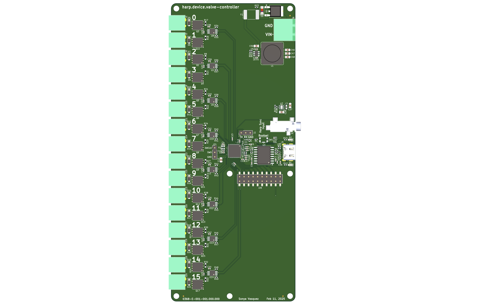

A Harp-compliant, 16-channel MOSFET Output board for valve control.

## Features
* Up to 5A total current consumption
* Up to 2A on any single output channel
* 8-GPIO expansion header

## Enclosure
See the companion [Onshape project](https://cad.onshape.com/documents/b68e9ca81d13baa37ddbb87a/w/239401edd39de6ea07d882fc/e/2e7e06ce5de5ab57a801ffd8) for the PCBA enclosure.
